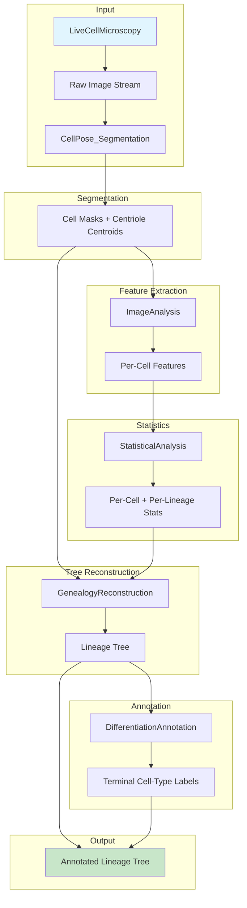

# MAP — AnalysisStack

## Directory and File Structure

```
AnalysisStack/
├── CONCEPT.md                          # Pipeline overview, cross-component dependencies, scientific rationale
├── KNOWLEDGE.md                        # Existing knowledge base: segmentation, centriole biology, statistics, lineage reconstruction, scRNA-seq
├── README.md                           # Merged README from 5 sub-subprojects (CellPose_Segmentation, ImageAnalysis, StatisticalAnalysis, GenealogyReconstruction, DifferentiationAnnotation)
├── MAP.md                              # This file — directory structure, file purposes, component relationships
├── EVIDENCE.md                         # Full reference list with DOIs and PMIDs (referenced by CONCEPT.md and KNOWLEDGE.md)
├── TODO.md                             # Consolidated task list across all sub-subprojects
├── PARAMETERS.md                       # Shared parameter specifications (imaging, segmentation thresholds, statistical cutoffs)
│
├── CellPose_Segmentation/
│   ├── README.md                       # Subproject overview: backbone, input/output, hardware target, throughput
│   ├── TODO.md                         # Phase A tasks: fine-tuning, pipeline integration, benchmarking
│   ├── configs/
│   │   ├── cellpose_params.yaml        # Model selection, channel order, diameter range, flow threshold
│   │   └── spotiflow_params.yaml       # Spot detection parameters: min_sigma, max_sigma, threshold, ROI gating
│   ├── models/
│   │   ├── cyto3_generalist/           # Base CellPose 3.0 generalist model (downloaded, not modified)
│   │   └── fine_tuned_bjhTERT/         # Fine-tuned weights for BJ-hTERT dividing cells (Phase A deliverable)
│   ├── src/
│   │   ├── segment_cells.py            # Wrapper: loads CellPose model, runs inference on single frame or stack
│   │   ├── detect_centrioles.py        # Spotiflow-based centriole detection within cell masks
│   │   ├── merge_channels.py           # Aligns red/green centriole channels with cell masks
│   │   └── export_hdf5.py              # Writes per-frame masks + centroid tables to HDF5
│   ├── tests/
│   │   ├── test_segment_cells.py       # Unit tests for cell segmentation (F1 ≥ 0.95 target)
│   │   ├── test_detect_centrioles.py   # Unit tests for centriole detection (F1 ≥ 0.90 target)
│   │   └── test_merge_channels.py      # Tests channel alignment and mask gating
│   └── data/
│       ├── sample_frames/              # Small test image stack (2-3 frames) for CI
│       └── ground_truth/               # Hand-annotated masks for benchmarking (10% of frames)
│
├── ImageAnalysis/
│   ├── README.md                       # Subproject overview: centriole age signal, maturity marker, ciliation status
│   ├── TODO.md                         # Feature extraction milestones
│   ├── PARAMETERS.md                   # GT335 intensity thresholds, Ninein colocalization radius, cilia detection parameters
│   ├── src/
│   │   ├── extract_features.py         # Per-cell feature extraction: GT335 ratio, Ninein localization, ciliation
│   │   ├── morphology_features.py      # Cell area, circularity, nuclear-to-cytoplasmic ratio
│   │   ├── intensity_ratios.py         # Red/green centriole channel intensity ratio computation
│   │   └── export_features.py          # Writes per-cell feature table (CSV/Parquet)
│   ├── tests/
│   │   ├── test_extract_features.py    # Tests feature extraction against ground-truth annotations
│   │   └── test_intensity_ratios.py    # Tests ratio computation with synthetic data
│   └── data/
│       └── feature_schema.yaml         # Schema definition for output feature tables
│
├── StatisticalAnalysis/
│   ├── README.md                       # Subproject overview: mixed-effects models, survival analysis, Bayesian inference
│   ├── TODO.md                         # Model development and validation tasks
│   ├── src/
│   │   ├── per_cell_stats.py           # Descriptive statistics per cell (mean, variance, quantiles)
│   │   ├── per_lineage_stats.py        # Lineage-level statistics (branching rates, centriole inheritance patterns)
│   │   ├── mixed_effects_model.py      # Linear mixed-effects model for centriole age vs. senescence markers
│   │   ├── survival_analysis.py        # Kaplan-Meier + Cox PH for time-to-centriole-loss or senescence onset
│   │   └── bayesian_model.py           # Bayesian hierarchical model for lineage-correlated data
│   ├── tests/
│   │   ├── test_mixed_effects.py       # Tests against simulated lineage data with known ground truth
│   │   └── test_survival.py            # Tests survival estimators with censored data
│   └── data/
│       └── simulation_params.yaml      # Parameters for synthetic lineage data generation
│
├── GenealogyReconstruction/
│   ├── README.md                       # Subproject overview: tree reconstruction from tracked cells + division events
│   ├── TODO.md                         # Tree-building algorithm milestones
│   ├── src/
│   │   ├── build_tree.py               # Constructs directed acyclic graph from tracked cell IDs and division events
│   │   ├── link_tracks.py              # Temporal linking of cell masks across frames (using overlap + centriole identity)
│   │   ├── resolve_divisions.py        # Identifies division events from cell splitting + centriole segregation
│   │   ├── validate_tree.py            # Checks tree consistency (no cycles, correct parent-child relationships)
│   │   └── export_tree.py              # Writes tree in Newick or JSON format
│   ├── tests/
│   │   ├── test_build_tree.py          # Tests tree construction with synthetic division sequences
│   │   └── test_resolve_divisions.py   # Tests division detection with simulated centriole segregation
│   └── data/
│       └── tree_schema.yaml            # Schema for tree output format
│
├── DifferentiationAnnotation/
│   ├── README.md                       # Subproject overview: scRNA-seq + immunostaining → terminal cell-type assignment
│   ├── TODO.md                         # Annotation pipeline milestones
│   ├── src/
│   │   ├── annotate_cell_types.py      # Supervised classification using reference atlases (elastic-net, SVM)
│   │   ├── integrate_scRNAseq.py       # Maps single-cell RNA-seq data to imaged cells (if available)
│   │   ├── immunostaining_classifier.py# Classifies terminal cell types from immunostaining markers
│   │   └── export_annotations.py       # Writes per-cell type labels with confidence scores
│   ├── tests/
│   │   ├── test_annotate_cell_types.py # Tests classification accuracy against held-out annotations
│   │   └── test_integrate_scRNAseq.py  # Tests integration with synthetic expression data
│   └── data/
│       ├── reference_signatures/       # Cell-type reference signatures (from Tabula Sapiens, HCL)
│       └── marker_panels.yaml          # Immunostaining marker panel definitions
│
└── shared/
    ├── utils/
    │   ├── io_utils.py                 # Shared HDF5/CSV/Parquet reading/writing utilities
    │   ├── geometry_utils.py           # Distance calculations, ROI overlap, centroid operations
    │   └── logging_utils.py            # Standardized logging configuration
    └── schemas/
        ├── cell_mask_schema.yaml       # HDF5 schema for cell masks
        ├── centriole_table_schema.yaml # Schema for centriole centroid tables
        └── feature_table_schema.yaml   # Schema for per-cell feature tables
```

## Component Relationships



## File-by-File Purpose

- **CONCEPT.md**: Defines the pipeline architecture, cross-component data flow, scientific hypothesis (centriole inheritance and aging), and consortium roles.
- **KNOWLEDGE.md**: Consolidates existing literature and methods across segmentation, centriole biology, statistics, lineage reconstruction, and scRNA-seq.
- **README.md**: Merged entry point for all five sub-subprojects, providing quick facts and status.
- **MAP.md**: This file — structural map of the entire AnalysisStack.
- **EVIDENCE.md**: Complete reference list with DOIs and PMIDs for all cited works.
- **TODO.md**: Consolidated task list tracking progress across all sub-subprojects.
- **PARAMETERS.md**: Shared parameter specifications ensuring consistency across segmentation, feature extraction, and statistical analysis.
- **CellPose_Segmentation/**: AI-based cell and centriole segmentation using CellPose 3.0 + spotiflow. Produces HDF5 masks and centroid tables.
- **ImageAnalysis/**: Feature extraction from segmented cells — centriole age signal (GT335 ratio), maturity markers (Ninein), ciliation status, morphology.
- **StatisticalAnalysis/**: Mixed-effects models, survival analysis, and Bayesian inference for lineage-correlated data.
- **GenealogyReconstruction/**: Builds lineage trees from tracked cells, division events, and centriole segregation patterns.
- **DifferentiationAnnotation/**: Assigns terminal cell-type labels using scRNA-seq reference atlases and immunostaining markers.
- **shared/**: Common utilities (I/O, geometry, logging) and schema definitions ensuring interoperability between sub-subprojects.