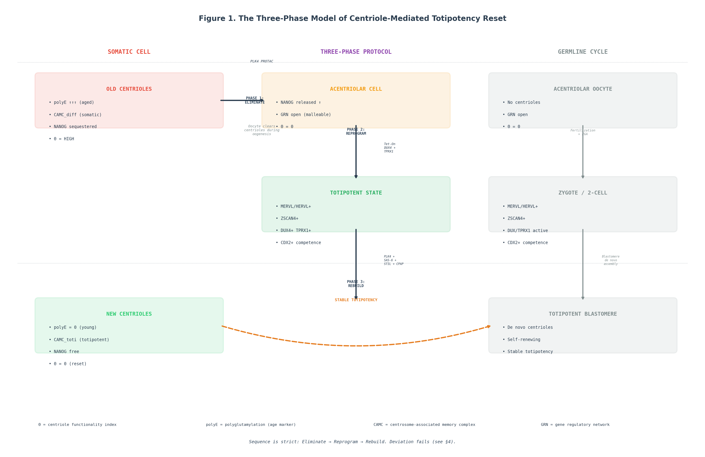

# Eliminate, Reprogram, Rebuild: The Centriole as a Structural Ratchet That Restricts Cellular Reprogramming to Totipotency

Jaba Tqemaladze

Georgia Longevity Alliance; Kutaisi International University; Free University of Tbilisi; Agricultural University of Georgia

**Author Note**

Jaba Tqemaladze  https://orcid.org/0000-0001-8651-7243

Correspondence concerning this article should be addressed to Jaba Tqemaladze, Georgia Longevity Alliance, Tbilisi, Georgia. Email: jaba@longevity.ge

---

**Abstract**

Somatic cell nuclear transfer succeeds (Wilmut et al., 1997) but depends on oocyte cytoplasm that has undergone natural centriole elimination. No method using transcription factors, small molecules, or culture conditions alone has produced sustained totipotency from a fully differentiated somatic cell—though transient totipotent-like states can be induced from pluripotent stem cells, and stable totipotent-like stem cells (TLSCs) have been derived from mouse embryonic stem cells through chemical chromatin remodeling (Yang et al., 2022).

Here we propose the centriole functions as a structural stabilizer of the differentiated state. Through conservative replication, asymmetric inheritance, and active regulatory roles, the mother centriole physically maintains the somatic gene regulatory network. Oocytes eliminate centrioles before totipotency in every metazoan examined; the germline resets the hardware at each generation, but the soma cannot. We outline a three-phase protocol—Eliminate (PLK4 PROTAC-mediated centriole removal), Reprogram (Tet-On DUX4 plus TPRX1), and Rebuild (de novo centriole assembly)—and predict that centriole elimination combined with totipotency factors will yield stable, self-renewing totipotent cells, distinct from transient 8C-like cells. We specify six quantitative falsification criteria, compare four alternative models, and propose a two-phase experimental design with a composite totipotency index as the primary endpoint.

*Keywords:* centriole, totipotency, reprogramming, DUX4, PLK4, structural ratchet, cellular memory

---

## The Totipotency Barrier

Totipotency—the capacity of a single cell to produce an entire organism including extraembryonic tissues—is confined to the zygote and the first few cleavage divisions (Genet & Torres-Padilla, 2020; Lu & Zhang, 2015). OSKM reprogramming yields pluripotency, not totipotency: iPSCs cannot form trophectoderm and do not activate the MERVL/HERVL program characteristic of the two-cell embryo (Hendrickson et al., 2017).

A useful distinction can be drawn between two categories of cellular information. **Software**—the epigenome, comprising DNA methylation, histone modifications, and chromatin architecture—is enzymatically reversible. OSKM resets this layer. **Hardware**—structural organelles that accumulate damage and cannot be repaired in situ—is not reset by OSKM. The centriole exemplifies hardware: it duplicates by conservative templating, is never fully disassembled, and progressively accumulates polyglutamylation and carbonylation (Nigg & Holland, 2018; Sullenberger et al., 2020).

We propose that achieving totipotency from a somatic cell requires not only epigenetic reprogramming but physical elimination of the centriole—a hardware reset that, in nature, is restricted to the germline. The centriole, we argue, functions as a structural ratchet.

## The Centriole as a Structural Ratchet

### Three Defining Properties

**Conservative replication.** The mother centriole persists across the cell cycle; its structural features—polyglutamylation pattern, centriole-associated memory complex (CAMC) composition—propagate to the daughter during assembly (Banterle & Gönczy, 2017; Nigg & Holland, 2018). Centriole over-elongation correlates with donor age in plasma cells (Köhrer et al., 2023). De novo biogenesis proceeds through bicentriole intermediates with distinct three-dimensional architecture (Pereira et al., 2021); elevated Plk4 concentration triggers autonomous de novo assembly independently of pre-existing centrioles (Nabais et al., 2021).

**Asymmetric inheritance.** In most mammalian stem cell systems examined to date, the older mother centriole is retained by the stem cell daughter while the newer centriole segregates to the differentiating daughter (Barandun & Oxenius, 2025; Chen & Yamashita, 2021; Royall et al., 2023; Thomas & Meraldi, 2024). Odf2 (cenexin), a mother centriole-specific protein, governs asymmetric distribution of CD133-positive endosomes; deletion of Odf2 converts asymmetric to symmetric division, providing direct evidence that centriole maturity determines daughter cell fate (Kunimoto et al., 2026). A notable exception exists: Drosophila male germline stem cells retain the daughter centrosome in the self-renewing daughter (Yamashita et al., 2007). The ratchet mechanism is conserved; its handedness is lineage-specific.

**Active regulatory functions.** NANOG—a core pluripotency transcription factor—colocalizes with the centrosome and associates spatiotemporally with centriole maturation across eleven tumor and non-tumor cell lines (Mikulenkova et al., 2020). This is an observation, not a functional demonstration; whether centrosomal NANOG is actively sequestered or merely colocalized remains unknown. PCM1 links centrosome asymmetry to polarized endosome dynamics, regulating daughter cell fate through Notch signaling in zebrafish radial glia (Zhao et al., 2025). This represents signal transduction rather than direct transcriptional control. As the basal body of the primary cilium, the centriole organizes Hedgehog, Wnt, and TGF-β pathways; cilium resorption failure alone is sufficient to induce cellular senescence (Jeffries et al., 2019).

### The Differentiation Ratchet: A Molecular Mechanism

We propose the centriole enforces the differentiated state through three interconnected processes. First, **polyglutamylation memory**: centriolar microtubules accumulate polyglutamylation with each division; this post-translational mark recruits specific pericentriolar material proteins (centriolin, CEP350) that anchor signaling complexes. The polyglutamylation pattern propagates semi-conservatively to the daughter centriole, creating a structural "age tag" (Köhrer et al., 2023). Second, **CAMC retention**: differentiation-specific proteins, potentially including transcription factors and chromatin modifiers, are recruited to the pericentriolar material through coiled-coil adaptors. The mother centriole thus titrates these factors away from the nucleoplasm. Third, **cilium-dependent signaling lock**: the primary cilium, templated by the mother centriole, sustains Hedgehog, Wnt, and TGF-β signaling in a differentiation-appropriate configuration. Only physical elimination can break all three locks simultaneously. The Phase 3 Rebuild step is required not for totipotency per se—oocytes are totipotent before fertilization and de novo assembly—but for mitotic stability of the resulting totipotent cells.

### A Formal Model of the Ratchet

Let the cell state be represented by a vector **S** = (*E*, *C*, *T*) where *E* denotes the epigenetic state (chromatin accessibility at totipotency loci), *C* denotes the centriolar state (age, post-translational modifications, associated proteins), and *T* denotes the transcriptional program. The probability of transition from a somatic to a totipotent state is:

> *P*(*S*_somatic → *S*_totipotent) = *f*(*E*) · *g*(*C*)

where *f*(*E*) ∈ [0,1] captures chromatin accessibility at DUX4/TPRX1 target sites, and *g*(*C*) ∈ [0,1] captures the centriolar barrier. Under this model:

- *g*(*C*_old) ≈ 0 for somatic centrioles with extensive polyglutamylation and differentiation-appropriate CAMC
- *g*(*C*_young) ≈ 1 for ESC centrioles (few divisions, minimal polyE accumulation)
- *g*(*C*_eliminated) = 1 for acentriolar cells (barrier removed)

This formulation accounts for three key observations: (a) TLSCs are accessible from ESCs (*C*_young) without centriole manipulation—because *g*(*C*_young) ≈ 1, only *f*(*E*) must be increased; (b) 8CLCs from naive ESCs are transient—though *g*(*C*_young) allows the transition, centrioles reassert the pluripotency gene regulatory network within one to two divisions; (c) somatic cells resist totipotency despite chromatin opening—because *g*(*C*_old) ≈ 0, even full chromatin accessibility (*f*(*E*) = 1) is insufficient.

**Discriminating prediction.** If the TLSC protocol (DOT1Li + KDM5Bi) is applied to fibroblasts with and without centriole elimination, the model predicts: TLSC alone → CTI < 0.2 (*g*(*C*_old) ≈ 0); TLSC + elimination → CTI > 0.5 (*g*(*C*_eliminated) = 1). A 2 × 2 factorial design—(elimination ±) × (chromatin opening ±)—provides the cleanest test.

### Why Pluripotent Cells Do Not Require Centriole Elimination

TLSC and human totipotent blastomere-like cell (hTBLC) protocols achieve totipotent-like states from pluripotent cells without centriole manipulation (Li et al., 2024; Yang et al., 2022). hTBLCs do not express DUX4 or TPRX1; they achieve totipotency through spliceosome inhibition, an independent pathway. Two barriers separate somatic from totipotent states. The first is **chromatin**: DUX4 binding sites are epigenetically closed in somatic cells by OTX2 (Kong et al., 2026), EHMT2-mediated H3K9me2 spreading from LINE-1 elements (Chatterjee et al., 2026), and cohesin-dependent loop structures modulated by WAPL and the DPPA2-DUX axis (Carey et al., 2026). The second is the **centriolar ratchet** described above. 8CLCs arise at a frequency of only 0.2–2% among naive human ESCs (Taubenschmid-Stowers et al., 2022) and cannot be maintained in culture. TLSCs succeed from ESCs because ESCs carry centrioles with minimal accumulated modification; the ratchet has not yet engaged. Somatic cells, having traversed multiple asymmetric divisions, carry old centrioles with differentiation-appropriate CAMC profiles.

## Natural Precedent: Centriole Elimination in the Germline

**Table 1**

*Centriole Fate Across Five Model Organisms*

| Organism | Oocyte centrioles | Sperm centriole | De novo after fertilization |
|----------|-------------------|-----------------|-----------------------------|
| Human | Eliminated | Atypical (seed only) | Yes |
| Mouse | Eliminated | Degraded | Yes |
| Drosophila | Eliminated (Polo-dependent) | One centriole (seed) | Yes |
| C. elegans | Eliminated | Sperm-derived | Yes |
| Zebrafish | Eliminated | Two centrioles | Yes |

Totipotency coincides with centriole absence in the oocyte and de novo assembly in the zygote across five model organisms (Fishman et al., 2018; Manandhar et al., 2005). In the mouse, GFP-centrin-2-labeled centriolar structures persist through metaphase I and II, associated with pericentriolar material, and are eliminated only at follicle recruitment and meiotic resumption (Manil-Ségalen et al., 2018). Elimination is progressive, not instantaneous.

The causal evidence, though sparse, is instructive. Pimenta-Marques et al. (2016) demonstrated that perturbing the Polo–pericentriolar matrix maintenance program prevents centriole loss in Drosophila oocytes; retained mother centrioles produced excess centrioles, leading to abnormal divisions and abortive development. Borrego-Pinto et al. (2016) showed that starfish oocytes employ two distinct elimination mechanisms—mother centrioles extruded into polar bodies, daughter centrioles degraded in the cytoplasm. The mechanistic diversity (Polo-dependent in Drosophila, Polo-independent in C. elegans, dual-mechanism in starfish) indicates convergent evolution: centriole elimination has been solved independently in multiple lineages, arguing against an epiphenomenon. Notably, oocyte centriole elimination proceeds without p53 activation—a fundamental difference from somatic cells, where centriole loss triggers p53-dependent and p53-independent stress responses.

Planarians lost centrosomes from dividing cells during evolution (Azimzadeh et al., 2012). Their neoblasts are centriole-free but pluripotent, not totipotent—demonstrating that elimination alone, without appropriate reprogramming factors, is insufficient to specify a totipotent ground state.

## The Three-Phase Hypothesis

**Figure 1**

*The Three-Phase Model: Eliminate, Reprogram, Rebuild*

*Note.* Schematic of the proposed protocol. Phase 1 (Eliminate): PLK4 inhibition or PROTAC-mediated degradation removes the somatic centriole. Phase 2 (Reprogram): Tet-On inducible DUX4 plus TPRX1 drives the totipotency gene regulatory network in the acentriolar cell. Phase 3 (Rebuild): Controlled de novo centriole assembly restores mitotic stability to the totipotent cell. The interval between centriole disassembly and de novo assembly constitutes the "window of plasticity" during which gene regulatory network reset is maximal.

### Phase 1: Eliminate

In nature, the oocyte clears its centrioles during oogenesis (Kalbfuss & Gönczy, 2023). Ultrastructural analysis reveals that elimination initiates with loss of SAS-1, followed by organelle expansion, microtubule disassembly, and dynein-dependent clearance (Pierron et al., 2023). The mechanisms are species-specific; no universal molecular pathway exists.

In the protocol, centrioles are removed using one of several approaches: PLK4 PROTAC SP27 (Sun et al., 2023), PLK4 inhibitors such as centrinone or RP-1664 (Soria-Bretones et al., 2025), auxin-inducible degron (AID)-tagged PLK4, CRISPR/Cas9-inducible knockout of PLK4 or STIL, or laser ablation. A critical caveat accompanies the PROTAC approach: SP27 has been validated only in TRIM37-amplified MCF-7 breast cancer cells. Its efficacy in normal diploid fibroblasts is unknown and represents a mandatory preliminary experiment. TRIM37 normally prevents the formation of ectopic centriolar protein assemblies (Balestra et al., 2021). Centrioles are exceptionally stable structures with near-zero tubulin turnover (Kochanski & Borisy, 1990); prolonged PLK4 inhibition over seven to fourteen days, combined with shRNA-mediated destabilization of structural proteins such as HsPOC1A, HsPOC1B, or CEP350, may be necessary to achieve complete elimination. Time-course quantification by expansion microscopy at Days 0, 3, 5, 7, 10, and 14 is essential.

**The Renzova paradox.** Centriole loss in human pluripotent stem cells triggers differentiation through both p53-dependent and p53-independent mechanisms, including altered protein turnover and mitotic delays (Renzova et al., 2018). This appears to contradict the ratchet model: if centriole loss enhances plasticity, why does it cause differentiation in hPSCs? We offer three non-mutually-exclusive resolutions. First, context-dependence: in hPSCs, centriole loss activates p53 and mitotic stress pathways that collapse the pluripotency gene regulatory network, leading to stochastic differentiation; in somatic cells exposed to totipotency factors, the same malleability should be directed toward the totipotency program. Second, the centriole stabilizes whichever gene regulatory network is active at the moment of its removal. Third, p53 is a partial mediator. PFT-α (a p53 inhibitor) combined with a PIDDosome inhibitor (Mikule et al., 2007; Rizzotto et al., 2024), strictly limited to Phases 1 and 2 with full washout and karyotype verification before Phase 3, should prevent differentiation and permit redirection toward totipotency. The experimental resolution—PLK4 inhibition plus PFT-α plus PIDDosome inhibitor plus DUX4/TPRX1 in hPSCs—must produce MERVL-positive cells before proceeding. This constitutes a gatekeeper criterion: Phase 2 of the protocol is conditional on resolving the Renzova paradox in hPSCs.

### Phase 2: Reprogram

Totipotency factors are delivered to the acentriolar cell. A Tet-On inducible system drives DUX4 and TPRX1 (Hendrickson et al., 2017; Whiddon et al., 2017; Zou et al., 2022). DUX4 expression must be titratable: sustained high-level expression causes apoptosis through the FSHD pathological mechanism (Lemmers et al., 2010), whereas transient pulses activate zygotic genome activation genes without killing the cell. Chromatin-opening strategies tested in parallel include OTX2 knockdown by siRNA or CRISPR—OTX2 maintains H3K9me3 and H3K27me3 at DUX4 target sites independently of DUX4 itself (Kong et al., 2026)—and broad-spectrum chromatin relaxation using the HDAC inhibitor trichostatin A combined with the DNA methyltransferase inhibitor 5-aza-2′-deoxycytidine. A critical control must verify that MERVL/HERVL activation is DUX4/TPRX1-dependent rather than a generic stress response to heat shock or drug treatment.

### Phase 3: Rebuild

De novo centriole assembly employs degron-tagged PLK4 with minimal co-factors (SAS-6, STIL, CPAP) for synchronous single-centriole assembly. Heat shock (42°C for two hours) provides an alternative trigger (Baek et al., 2016), though its efficiency is approximately 50% and population heterogeneity must be accounted for. Turing-like reaction-diffusion patterning ensures the establishment of a single Plk4 focus (Wilmott et al., 2023); Cdk-dependent phosphorylation of Ana2/STIL terminates centriole elongation (Steinacker et al., 2022); and ZYG-1/Plk4 phosphorylation of SAS-5 stabilizes the cartwheel (Sankaralingam et al., 2024). Electron microscopy confirmation of structural normality is indispensable.

We explicitly note that Phase 3 is required for mitotic stability, not for totipotency as such. Oocytes are totipotent before fertilization and before de novo centriole assembly. Acentriolar totipotent cells would be functionally complete but mitotically fragile. Rebuild converts a transient totipotent state into a stable, self-renewing one.

The Eliminate and Reprogram phases are expected to overlap: centriole loss is progressive over two to three divisions, and reprogramming factors can be introduced during this window. The interval between centriole disassembly and de novo assembly constitutes a "window of plasticity" during which the cell is maximally receptive to gene regulatory network reset.

## Predictions

**Prediction 1.** Centriole elimination followed by DUX4 plus TPRX1 will produce stable totipotent cells. The Composite Totipotency Index (CTI)—defined as the geometric mean of normalized expression of MERVL/HERVL, ZSCAN4, TPRX1, and the DUX4 target genes LEUTX, ZFP352, and DUB1—will exceed 0.6 (on a scale where 1.0 equals the eight-cell embryo transcriptome and 0.0 equals the untreated fibroblast baseline; negative values are set to zero) after ten passages, with at least 20% of cells expressing CDX2 and GATA3 upon BMP4-directed differentiation. DUX4 plus TPRX1 alone, with centrioles intact, will yield a CTI below 0.2 that decays to baseline within two to three passages.

**Prediction 2.** Centriole elimination combined with OSKM will increase reprogramming efficiency at least twofold over OSKM alone, measured as a continuous fold-change in alkaline phosphatase-positive colony count.

**Prediction 3.** Re-expression of PLK4 to restore centrioles will reduce the CTI to 0.2 or below within two passages, confirming that the effect is causally dependent on centriole absence.

**Prediction 4.** Nuclear NANOG protein will increase at least twofold after centriole elimination, temporally preceding MERVL activation (NANOG increase expected at 12–24 hr; MERVL at 48–72 hr).

**Prediction 5.** NANOG overexpression will partially recapitulate the centriole elimination effect, raising the CTI to 0.3–0.4, but will not reach the full effect (CTI > 0.6), consistent with other centriole functions—cilium signaling and PCM1-mediated fate determination—remaining intact.

## Falsification Criteria

The hypothesis is falsified—not merely unsupported—if any of the following outcomes are observed.

1. **CTI fold-change below 1.5** (elimination plus factors versus factors alone, *p* > .05 after Benjamini-Hochberg correction). The centriole is not a barrier to totipotency factor action in somatic cells.

2. **OSKM reprogramming fold-change below 1.5** with centriole elimination. Hardware reset does not enhance nuclear reprogramming.

3. **Fewer than 1% CDX2 and GATA3 double-positive cells** after BMP4 differentiation at Day 35. The MERVL-positive state is a partial two-cell-like state, not true totipotency.

4. **IFT88 shRNA recapitulates at least 80% of the centriole elimination effect.** The active component is the primary cilium rather than the centriole itself. The hypothesis would not be entirely falsified—the centriole templates the cilium—but the mechanistic locus would shift.

5. **The TLSC protocol applied to fibroblasts without centriole elimination produces a stable CTI above 0.5 in more than 30% of cells.** Chromatin remodeling alone suffices; the centriolar ratchet is unnecessary. This is the most critical control experiment.

6. **p53 cDNA rescue during Phases 1 and 2 abolishes the centriole elimination effect on reprogramming.** The effect is entirely p53-mediated; the centriole is merely one of many p53 activators.

The continuous CTI fold-change serves as the primary endpoint—preserving statistical power and enabling detection of partial effects that binary thresholds would miss.

## Experimental Design

**Two-phase design.** The pilot phase comprises six groups (*n* = 3–5 per group, approximately USD 300,000, 12–18 months): (1) untreated fibroblasts, (2) DUX4 plus TPRX1 alone, (3) centriole elimination alone, (4) elimination plus DUX4 plus TPRX1, (5) elimination plus OSKM, and (6) the TLSC protocol alone—the critical chromatin-only control. A 2 × 2 factorial extension is recommended: elimination (±) crossed with chromatin opening (±), yielding four core groups that cleanly separate the contributions of the two barriers.

If Group 4 shows a CTI at least twofold greater than Group 2 in the pilot, the study proceeds to the confirmatory phase (six additional groups, *n* = 15–20 per group, approximately USD 2.5 million, 3 years) with mechanism-level controls: p53 rescue, IFT88 shRNA, NANOG knockdown, PLK4 re-expression rescue, and PIDDosome inhibition.

**Gatekeeper criteria.** Progression to Phase 2 (Reprogram) is conditional on demonstrating that centriole elimination plus DUX4/TPRX1 in hPSCs produces MERVL-positive cells—resolving the Renzova paradox. Progression to Phase 3 (Rebuild) is conditional on showing that acentriolar reprogrammed cells without Rebuild are functionally totipotent but mitotically unstable.

**Power analysis.** For a CTI fold-change of 1.5 with a coefficient of variation of 50%, *n* = 20 yields approximately 70% power; *n* = 28 yields approximately 85% power (two-sided *t*-test, α = .05/6 ≈ .008 with Benjamini-Hochberg correction). A Bayesian approach with a Bayes factor threshold of 3, using pilot data to construct informed priors, can reduce the required sample size by roughly 30–40%.

**Totipotency validation—four tiers.** Tier 1 (Transcriptional): single-cell RNA sequencing confirms co-expression of eight-cell-like markers (ZSCAN4, LEUTX, TPRX1, H3.Y) together with trophectoderm markers (CDX2, GATA3, TFAP2C) and primitive endoderm markers (GATA6, SOX17). Tier 2 (Epigenetic): broad H3K4me3 domains at zygotic genome activation loci, loss of H3K9me3 at DUX4 binding sites, and DNA methylation profiles matching the eight-cell embryo. Tier 3 (Functional): formation of integrated blastoids with correct spatial organization, cultured to Day 14 in accordance with ISSCR Guidelines. Tier 4 (Stringent, mouse only): tetraploid complementation producing term offspring with germline contribution. Cells meeting Tiers 1 through 3 are designated "candidate totipotent"; Tier 4 is the definitive standard.

## Discussion

### The Centriole as a Cell-State Memory Device

The centriole satisfies the criteria for a physical memory device: it encodes information (polyglutamylation, carbonylation, and associated proteins), persists without disassembly during mitosis, undergoes asymmetric inheritance, and can be erased only through elimination followed by de novo assembly. Independent support for the centrosome as a cellular memory platform comes from an unexpected quarter. Jovasevic et al. (2024) demonstrated that hippocampal neurons forming memory engrams accumulate centrosomal DNA damage repair complexes—TLR9, 53BP1, and γH2AX—at the centrosome hours after learning. Neuron-specific *Tlr9* knockdown impaired memory consolidation, centrosomal DNA repair, and ciliogenesis. Although the molecular details differ, the principle is identical: the centrosome anchors information that alters long-term cellular state.

### Why iPSCs Are Not Totipotent

OSKM reprograms the epigenetic software, but the centriole—as old as the somatic donor—remains. This residual hardware may account for the epigenetic memory of somatic origin (Kim et al., 2010), biased differentiation (Bar-Nur et al., 2011), poor trophectoderm contribution, and the reduced proliferative capacity of iPSCs from aged donors (Strässler et al., 2018).

### Comparison of Alternative Models

**Table 2**

*Discrimination Table for Five Models of the Totipotency Barrier*

| Experiment | Model A (Chromatin only) | Model B (p53-centric) | Model C (Sensor) | Model D (Ratchet) | Model E (Chromatin + factors) |
|------------|--------------------------|------------------------|-------------------|--------------------|-------------------------------|
| Elim. + DUX4 → stable totipotency | No effect | No effect if p53 blocked | Yes, nonspecific | Yes, factors required | Partial (chromatin opened) |
| p53 cDNA rescue Phase 1–2 | No effect | Abolishes | Partial | Partial | No effect |
| Elim. + neural factors → neurons | Not predicted | Not predicted | Yes | Yes | Not predicted |
| TLSC on fibroblasts alone | Yes | No prediction | Partial | Weak | Moderate (*f*(*E*) increased, *g*(*C*) unchanged) |
| TLSC + elimination on fibroblasts | No additional effect | No additional effect | Enhanced | Strong enhancement | Strong enhancement |
| 2 × 2 factorial test | Full effect in chromatin-open arm | Full effect in p53-blocked arm | Nonspecific enhancement | Full effect only when both open and eliminated | Partial in chromatin arm; full in combined |

The models are not mutually exclusive. The centriole likely functions simultaneously as a sensor of cellular state, an activator of p53, and a structural ratchet. A formal Bayesian model comparison using the Bayesian Information Criterion applied to pilot data can quantify the relative support for each model.

### Limitations

**Post-mitotic cells.** The ratchet model addresses proliferating lineages; post-mitotic aging proceeds through other counters such as lipofuscin accumulation and nuclear pore deterioration. Polyglutamylation is partially reversible through the action of deglutamylating enzymes (Rogowski et al., 2010), but irreversible oxidative damage accumulates with age.

**DUX4 toxicity, p53, and genome instability.** DUX4 causes NOXA-mediated apoptosis through the intrinsic mitochondrial pathway (Chammas et al., 2025). Centriole loss activates p53 through the PIDDosome complex (Mikule et al., 2007), and p53 in turn represses MERVL elements (Mizejewski et al., 2025). Acentriolar mitosis elevates chromosome segregation errors.

Three protective measures are therefore essential. First, p53 inhibitors must be strictly time-limited to Phases 1 and 2, with karyotyping and whole-genome sequencing performed at each phase transition to exclude cells harboring acquired aneuploidy or mutations. Second, PIDDosome inhibition offers a more selective alternative that may uncouple centriole loss from p53 activation without global p53 suppression. Third, DUX4 expression requires careful titration—sustained high levels cause apoptosis, but transient pulses activate zygotic genome activation without killing the cell (Lemmers et al., 2010).

**Technical unknowns.** PLK4 PROTAC SP27 has been validated only in TRIM37-amplified MCF-7 breast cancer cells; its efficacy in normal diploid fibroblasts is unknown. CAMC components may persist as cytoplasmic condensates after centriole disassembly, requiring proteomic characterization. NANOG-centrosome colocalization has been demonstrated in cancer cell lines; verification in primary human fibroblasts is necessary.

**Species extrapolation.** The evidence base spans *Drosophila*, *C. elegans*, zebrafish, bovine, and mouse. The proposed experiment in human dermal fibroblasts directly tests the hypothesis in the relevant species.

**Centriole stability.** Centriolar microtubules exhibit near-zero tubulin turnover (Kochanski & Borisy, 1990). Complete elimination may require prolonged PLK4 inhibition over 7–14 days combined with shRNA-mediated destabilization of structural proteins such as HsPOC1A, HsPOC1B, or CEP350. Pulsed-SILAC measurement of centriolar protein half-lives and time-course expansion microscopy at Days 0, 3, 5, 7, 10, and 14 will be essential for protocol optimization.

### Why the Centriole—and Not Another Organelle

The nuclear lamina, though long-lived (Toyama et al., 2013), disassembles during mitosis and is globally remodeled by OSKM reprogramming (Peric-Hupkes et al., 2010)—it is software-like despite being structural. The mitochondrial genome is maternally inherited; SCNT bypasses somatic mtDNA through the oocyte cytoplasm. The cytoskeleton is highly dynamic, with actin filaments turning over in seconds to minutes and microtubules in minutes; its state reflects rather than determines the transcriptional program. The centriole is uniquely suited as a cell-state memory device because it satisfies four criteria simultaneously: it never disassembles during the cell cycle, propagates structural features through conservative templating, is functionally connected to the transcriptional machinery (via NANOG, the cilium, and PCM1), and is programmed for elimination in the germline. No other organelle meets all four conditions.

### Ethical Considerations

Human dermal fibroblasts obtained from consenting adult donors under standard institutional review board protocols present minimal ethical concern. The generation of blastoids from reprogrammed cells must comply with the ISSCR 14-day rule and local regulations. Tetraploid complementation, the gold standard for totipotency, can be applied only in mice. Technologies enabling totipotency from somatic cells intersect with debates on human cloning and germline modification; proactive engagement with bioethics advisory bodies is recommended.

## Conclusion

We propose, as a falsifiable hypothesis, that the centriole functions as a structural ratchet—permitting forward differentiation while resisting spontaneous reversal—and that its elimination, combined with totipotency factor expression and controlled de novo assembly, may be sufficient to achieve sustained totipotency from a somatic cell. The hypothesis draws on four converging lines of evidence: the universal elimination of centrioles in oogenesis across five model organisms, the molecular distinction between pluripotency and totipotency programs, the transient nature of DUX4-induced 8CLCs and their origin from naive embryonic stem cells rather than somatic cells, and the conceptual distinction between epigenetically reversible software and structurally persistent hardware.

Several challenges remain unresolved. The TLSC-on-fibroblasts experiment may falsify the hypothesis outright. The Renzova paradox—centriole loss causing differentiation in pluripotent stem cells—requires dedicated experimental resolution before the full protocol can proceed. PLK4 PROTAC remains unvalidated in normal diploid fibroblasts. Controlled de novo centriole assembly at physiological copy number is technically demanding. These are not weaknesses of the hypothesis; they constitute its testable core. Whether the centriole is a causal determinant of cell-state boundaries or merely correlates with totipotency is an open empirical question that we invite the field to address. If confirmed, this hypothesis would establish that some aspects of cellular memory are structural rather than epigenetic—requiring a hardware reset, not merely a software update.

**Competing interests.** The author is the sole author. A preprint has been posted on ResearchGate (Tqemaladze, 2026). The author has no financial competing interests. The hypothesis was developed in discussion with Pierre Gönczy (EPFL), who provided comments but has no authorship or financial stake.

**Funding.** This research did not receive specific funding.

**Acknowledgments.** I thank Pierre Gönczy (EPFL) for valuable comments on centriole elimination mechanisms. The central experiment proposed here—centriole elimination combined with reprogramming to totipotency—has not been reported in the literature.

---

## References

Avidor-Reiss, T., Mazur, M., Fishman, E. L., & Sindhwani, P. (2019). The role of sperm centrioles in human reproduction—the known and the unknown. *Frontiers in Cell and Developmental Biology*, *7*, 188. https://doi.org/10.3389/fcell.2019.00188

Azimzadeh, J., Wong, M. L., Downhour, D. M., Sánchez Alvarado, A., & Marshall, W. F. (2012). Centrosome loss in the evolution of planarians. *Science*, *335*(6067), 461–463. https://doi.org/10.1126/science.1214457

Baek, I. K., Jang, Y. K., Lee, T. H., & Lee, J. (2016). Kinetic analysis of de novo centriole assembly in heat-shocked mammalian cells. *Cytoskeleton*, *73*(12), 691–702. https://doi.org/10.1002/cm.21341

Balestra, F. R., Domínguez-Calvo, A., Wolf, B., Busso, C., Buff, A., Averink, T., Lipsanen-Nyman, M., Huertas, P., Helleday, T., & Gönczy, P. (2021). TRIM37 prevents formation of centriolar protein assemblies by regulating Centrobin. *eLife*, *10*, e62640. https://doi.org/10.7554/eLife.62640

Banterle, N., & Gönczy, P. (2017). Centriole biogenesis: From identifying the characters to understanding the plot. *Annual Review of Cell and Developmental Biology*, *33*, 23–49. https://doi.org/10.1146/annurev-cellbio-100616-060454

Bar-Nur, O., Russ, H. A., Efrat, S., & Benvenisty, N. (2011). Epigenetic memory and preferential lineage-specific differentiation in induced pluripotent stem cells derived from human pancreatic islet beta cells. *Cell Stem Cell*, *9*(1), 17–23. https://doi.org/10.1016/j.stem.2011.06.007

Barandun, M., & Oxenius, A. (2025). Mother centrosome inheritance determines CD8+ T cell fate decisions in mice. *Cell Reports*, *44*(1), 115123. https://doi.org/10.1016/j.celrep.2024.115127

Borrego-Pinto, J., Somogyi, K., Karreman, M. A., König, J., Müller-Reichert, T., Bettencourt-Dias, M., Gönczy, P., Schwab, Y., & Jékely, G. (2016). Distinct mechanisms eliminate mother and daughter centrioles in meiosis of starfish oocytes. *Journal of Cell Biology*, *212*(7), 815–827. https://doi.org/10.1083/jcb.201510083

Carey, G. I., Vega-Sendino, M., Tillo, D., Ruiz, S., & Serrano, M. (2026). Alterations in chromatin organization promote totipotent-like features in a DPPA2/DUX-dependent manner. *The EMBO Journal*, in press.

Chammas, P., Xie, S. Q., Sepulveda-Rincon, L. P., Rodriguez-Terrones, D., Bonte, D., & Torres-Padilla, M. E. (2025). CRISPRa-mediated disentanglement of the Dux-MERVL axis in the 2C-like state, totipotency, and cell death. *Science Advances*, *11*(51), eadu9092. https://doi.org/10.1126/sciadv.adu9092

Chatterjee, K., Uyehara, C. M., Kasliwal, K., Mazumdar, S., & Madhani, H. D. (2026). Coordinated repression of totipotency-associated gene loci by histone methyltransferase EHMT2 via LINE1 regulatory elements. *EMBO Reports*, *27*(3), 654–676. https://doi.org/10.15252/embr.202357172

Chen, C., & Yamashita, Y. M. (2021). Centrosome-centric view of asymmetric stem cell division. *Open Biology*, *11*(2), 200314. https://doi.org/10.1098/rsob.200314

De Iaco, A., Planet, E., Coluccio, A., Verp, S., Duc, J., & Trono, D. (2017). DUX-family transcription factors regulate zygotic genome activation in placental mammals. *Nature Genetics*, *49*(6), 941–945. https://doi.org/10.1038/ng.3858

Fishman, E. L., Jo, K., Nguyen, Q. P. H., Kong, D., Royfman, R., Cekic, A. R., Khanal, S., Bae, K., Schimenti, J. C., & Avidor-Reiss, T. (2018). A novel atypical sperm centriole is functional during human fertilization. *Nature Communications*, *9*(1), 2210. https://doi.org/10.1038/s41467-018-04678-8

Gao, L., Gao, Q., Hai, N., Zhang, H., Liu, J., & Wang, H. (2026). Phase separation of DUX family proteins drives totipotent-like state via 3D genome reorganization and retrotransposon activation. *Protein & Cell*, pwag014. https://doi.org/10.1093/procel/pwag014

Genet, M., & Torres-Padilla, M. E. (2020). The molecular and cellular features of 2-cell-like cells: A reference guide. *Development*, *147*(16), dev189688. https://doi.org/10.1242/dev.189688

Halstead, M. M., Ma, X., Zhou, C., Schultz, R. M., & Ross, P. J. (2020). Chromatin remodeling in bovine embryos indicates species-specific regulation of genome activation. *Nature Communications*, *11*, 4654. https://doi.org/10.1038/s41467-020-18508-3

Hendrickson, P. G., Doráis, J. A., Grow, E. J., Whiddon, J. L., Lim, J. W., Wike, C. L., Weaver, B. D., Pflueger, C., Emery, B. R., Wilcox, A. L., Nix, D. A., Peterson, C. M., Tapscott, S. J., Carrell, D. T., & Cairns, B. R. (2017). Conserved roles of mouse DUX and human DUX4 in activating cleavage-stage genes and MERVL/HERVL retrotransposons. *Nature Genetics*, *49*(6), 925–934. https://doi.org/10.1038/ng.3844

Jeffries, E. P., DiGiacomo, J. W., Cici, D., Goon, W., & Gilmour, D. (2019). Cilium resorption failure is sufficient to induce cellular senescence. *Cell Reports*, *26*(9), 2251–2262. https://doi.org/10.1016/j.celrep.2019.01.100

Jovasevic, V., Wood, E. M., Cicvaric, A., Zhang, H., Petrovic, Z., Carboncino, A., Parker, K. K., Bassett, T. E., San Segundo-Acosta, P., Lo, I., Korb, E., Bhatt, R. R., Montagut-Bordas, C., Martínez, P., Radulovic, J., & Stetler, R. A. (2024). Formation of memory assemblies through the DNA-sensing TLR9 pathway. *Nature*, *628*(8006), 145–153. https://doi.org/10.1038/s41586-024-07220-7

Kalbfuss, N., & Gönczy, P. (2023). Extensive programmed centriole elimination unveiled in C. elegans embryos. *Science Advances*, *9*(22), eadg8682. https://doi.org/10.1126/sciadv.adg8682

Kim, K., Doi, A., Wen, B., Ng, K., Zhao, R., Cahan, P., Kim, J., Aryee, M. J., Ji, H., Ehrlich, L. I. R., Yabuuchi, A., Takeuchi, A., Cunniff, K. C., Hongguang, H., McKinney-Freeman, S., Naveiras, O., Yoon, T. J., Irizarry, R. A., Jung, N., ... Daley, G. Q. (2010). Epigenetic memory in induced pluripotent stem cells. *Nature*, *467*(7313), 285–290. https://doi.org/10.1038/nature09342

Kipreos, E. T., Agarwal, D., & Huang, J. (2014). Centrosome/cell cycle uncoupling and elimination in the endoreduplicating intestinal cells of C. elegans. *PLoS ONE*, *9*(11), e110958. https://doi.org/10.1371/journal.pone.0110958

Kochanski, R. S., & Borisy, G. G. (1990). Mode of centriole duplication and distribution. *Journal of Cell Biology*, *110*(5), 1599–1605. https://doi.org/10.1083/jcb.110.5.1599

Köhrer, S., Dittrich, D., Böhmer, M., Schleicher, N., Hausser, I., Walter, C., Müller-Tidow, C., Krämer, A., & Krämer, A. (2023). High-throughput electron tomography identifies centriole over-elongation as an early event in plasma cell disorders. *Leukemia*, *37*, 2450–2461. https://doi.org/10.1038/s41375-023-02056-2

Kong, X., Jiang, N., Chen, S., Zhang, Y., Liu, H., Zhao, Y., Wang, Z., Li, W., & Ma, H. (2026). OTX2 inhibits human pluripotent stem cell reprogramming toward 8-cell-like and morula-like states. *Nature Communications*, *17*(1), 1685. https://doi.org/10.1038/s41467-026-29012-z

Kunimoto, K., Nozaki, M., Kondo, T., Ikawa, M., Hirohashi, N., & Inaba, K. (2026). Odf2 regulates asymmetric distribution of CD133-positive endosomes and switches asymmetric to symmetric division. *The EMBO Journal*, in press.

Lemmers, R. J. L. F., van der Vliet, P. J., Klooster, R., Sacconi, S., Camaño, P., Dauwerse, J. G., Snider, L., Straasheijm, K. R., van Ommen, G. J., Padberg, G. W., Miller, D. G., Tapscott, S. J., Tawil, R., Frants, R. R., & van der Maarel, S. M. (2010). A unifying genetic model for facioscapulohumeral muscular dystrophy. *Science*, *329*(5999), 1650–1653. https://doi.org/10.1126/science.1189044

Li, S., Yang, M., Shen, H., Ding, L., Lyu, X., Lin, K., Ong, J., Du, P., & Chen, L. (2024). Capturing totipotency in human cells through spliceosomal repression. *Cell*, *187*(13), 3284–3302.e25. https://doi.org/10.1016/j.cell.2024.05.010

Lindhout, F. W., Kooistra, R., Portegies, V., Herstel, L. J., Stucchi, R., Wierenga, C. J., & Hoogenraad, C. C. (2021). Centrosome-mediated control of human cortical neurogenesis. *Nature Neuroscience*, *24*(3), 422–435. https://doi.org/10.1038/s41593-021-00800-y

Lu, F., & Zhang, Y. (2015). Cell totipotency: Molecular features, induction, and maintenance. *National Science Review*, *2*(2), 217–225. https://doi.org/10.1093/nsr/nwv009

Manandhar, G., Schatten, H., & Sutovsky, P. (2005). Centrosome reduction during gametogenesis and its significance. *Biology of Reproduction*, *72*(1), 2–13. https://doi.org/10.1095/biolreprod.104.031245

Manil-Ségalen, M., Luksza, M., Kim, T. A., Canal-Vonarburg, M., Basto, R., & Verlhac, M. H. (2018). Separation and loss of centrioles from primordial germ cells to mature oocytes in the mouse. *Scientific Reports*, *8*, 12791. https://doi.org/10.1038/s41598-018-31185-5

Mikule, K., Delaval, B., Kaldis, P., Jurcyzk, A., Hergert, P., & Doxsey, S. (2007). Loss of centrosome integrity induces p38-p53-p21-dependent G1-S arrest. *Nature Cell Biology*, *9*(2), 160–170. https://doi.org/10.1038/ncb1529

Mikulenkova, E., Faldikova, L., Liskova, K., Neradil, J., Veselska, R., & Hampl, A. (2020). NANOG/NANOGP8 localizes at the centrosome and is spatiotemporally associated with centriole maturation. *Cells*, *9*(3), 692. https://doi.org/10.3390/cells9030692

Mizejewski, G. J., Salvi, J. S., Vojtechova, I., Wang, X., Deng, T., & Prives, C. (2025). p53-mediated regulation of LINE1 retrotransposon-derived R-loops. *Journal of Biological Chemistry*, *301*(3), 108270. https://doi.org/10.1016/j.jbc.2025.108270

Nabais, C., Pessoa, D., de-Carvalho, J., van Zanten, T., Duarte, P., Mayor, S., Carneiro, J., Telley, I. A., & Bettencourt-Dias, M. (2021). Plk4 triggers autonomous de novo centriole biogenesis and maturation. *Journal of Cell Biology*, *220*(5), e202008090. https://doi.org/10.1083/jcb.202008090

Nigg, E. A., & Holland, A. J. (2018). Once and only once: Mechanisms of centriole duplication and their deregulation in disease. *Nature Reviews Molecular Cell Biology*, *19*(5), 297–312. https://doi.org/10.1038/nrm.2017.127

Ozaki, K., Chang, T. B., Yang, W. Q., Schrumpf, L. A., Yeung, N., Watanabe, N., Ohta, M., & Kitagawa, D. (2026). Adaptable centriole biogenesis via the intrinsically disordered protein ALMS1. *Nature Communications*, in press.

Pereira, S. G., Rodrigues-Martins, A., Louro, M. A. D., Borrego-Pinto, J., Callaini, G., Glover, D. M., & Bettencourt-Dias, M. (2021). The 3D architecture and molecular foundations of de novo centriole assembly via bicentrioles. *Current Biology*, *31*, 4340–4353.e7. https://doi.org/10.1016/j.cub.2021.07.057

Peric-Hupkes, D., Meuleman, W., Pagie, L., Bruggeman, S. W. M., Solovei, I., Brugman, W., Gräf, S., Flicek, P., Kerkhoven, R. M., van Lohuizen, M., Reinders, M., Wessels, L., & van Steensel, B. (2010). Molecular maps of the reorganization of genome-nuclear lamina interactions during differentiation. *Molecular Cell*, *38*(4), 603–613. https://doi.org/10.1016/j.molcel.2010.03.016

Pierron, M., Woglar, A., Busso, C., Jha, K., Morf, J., Piano, F., Müller-Reichert, T., & Gönczy, P. (2023). Centriole elimination during Caenorhabditis elegans oogenesis initiates with loss of the central tube protein SAS-1. *The EMBO Journal*, *42*(24), e115076. https://doi.org/10.15252/embj.2023115076

Pimenta-Marques, A., Bento, I., Lopes, C. A. M., Duarte, P., Jana, S. C., & Bettencourt-Dias, M. (2016). A mechanism for the elimination of the female gamete centrosome in Drosophila melanogaster. *Science*, *353*(6294), aaf4866. https://doi.org/10.1126/science.aaf4866

Posfai, E., Schell, J. P., Janiszewski, A., Rovic, I., Murray, A., Bradshaw, B., Pardon, G., El Bakkali, M., Talon, I., De Geest, N., Kumar, P., To, S. K., Petropoulos, S., Jurisicova, A., Pasque, V., Lanner, F., & Rossant, J. (2021). Evaluating totipotency using criteria of increasing stringency. *Nature Cell Biology*, *23*(1), 49–60. https://doi.org/10.1038/s41556-020-00609-2

Renzova, T., Bohaciakova, D., Esner, M., Pospisilova, V., Barta, T., Hampl, A., & Cajanek, L. (2018). Inactivation of PLK4-STIL module prevents self-renewal and triggers p53-dependent differentiation in human pluripotent stem cells. *Stem Cell Reports*, *11*(4), 929–944. https://doi.org/10.1016/j.stemcr.2018.08.008

Rizzotto, D., Vigorito, V., Rieder, P., Gallob, F., Moretta, G. M., Soratroi, C., Riley, J. S., Bellutti, F., Veli, S. L., Rossi, A., Lardeux, F., Tait, S. W. G., & Villunger, A. (2024). Caspase-2 kills cells with extra centrosomes. *Science Advances*, *10*(44), eado6607. https://doi.org/10.1126/sciadv.ado6607

Rogowski, K., van Dijk, J., Magiera, M. M., Bosc, C., Deloulme, J. C., Bosson, A., Peris, L., Gold, N. D., Lacroix, B., Bosch Grau, M., Bec, N., Larroque, C., Desagher, S., Holzer, M., Andrieux, A., Moutin, M. J., & Janke, C. (2010). A family of protein-deglutamylating enzymes associated with neurodegeneration. *Cell*, *143*(4), 564–578. https://doi.org/10.1016/j.cell.2010.10.014

Royall, L. N., Machado, R. A. C., Jessop, M. A., Denoth-Lippuner, A., Buchser, A., van den Berg, P. R., Jessberger, S., & Knoblich, J. A. (2023). Asymmetric inheritance of centrosomes maintains stem cell properties in human neural progenitor cells. *eLife*, *12*, e83157. https://doi.org/10.7554/eLife.83157

Sankaralingam, P., Wang, S., Li, H., O'Connell, K. F., & Kim, D. Y. (2024). ZYG-1 kinase-dependent phosphorylation of SAS-5 regulates centriole assembly and prevents excess centrioles. *EMBO Reports*, *25*(6), 2698–2721. https://doi.org/10.15252/embr.202357163

Segura, R. C., Gallaud, E., Sythoff, A. V. B., Panneton, V., Royou, A., & Cabernard, C. (2025). Asymmetry of centrosomes in Drosophila neural stem cells requires protein phosphatase 4. *Molecular Biology of the Cell*, *36*(5), ar58. https://doi.org/10.1091/mbc.E24-12-0553

Soria-Bretones, I., Thu, K. L., Silvester, J., Cruickshank, J., El Ghamrasni, S., Bearss, A., Long, J., Ren, Y., Wang, L., Berger, M., Tran, P., Anders, C. K., Cescon, D. W., Hakem, R., & Hakem, A. (2025). The PLK4 inhibitor RP-1664 demonstrates potent single-agent efficacy in neuroblastoma models. *Research Square*, preprint. https://doi.org/10.21203/rs.3.rs-3149815/v1

Steinacker, T. L., Wong, S. S., Novak, Z. A., Saurya, S., Gartenmann, L., van Haren, J., Wainman, A., & Raff, J. W. (2022). Cdk-dependent phosphorylation of Ana2/STIL controls the transition to the mitotic state and centriole number. *Journal of Cell Biology*, *221*(9), e202202118. https://doi.org/10.1083/jcb.202202118

Strässler, E. T., Aalto-Setälä, K., Kiamehr, M., Landmesser, U., & Kränkel, N. (2018). Age is relative—Impact of donor age on induced pluripotent stem cell-derived cell functionality. *Frontiers in Cardiovascular Medicine*, *5*, 4. https://doi.org/10.3389/fcvm.2018.00004

Sullenberger, C., Vasquez-Limeta, A., Kong, D., & Loncarek, J. (2020). With age comes maturity: Biochemical and structural transformation of a human centriole in the making. *Cells*, *9*(6), 1429. https://doi.org/10.3390/cells9061429

Sun, Y., Wang, C., Li, H., Zhang, Y., Liu, J., Chen, X., Zhou, J., Xu, S., Zhao, Z., Ding, K., & Chen, Y. (2023). Discovery of the first potent, selective, and in vivo efficacious Polo-like kinase 4 proteolysis targeting chimera degrader for the treatment of TRIM37-amplified breast cancer. *Journal of Medicinal Chemistry*, *66*(12), 8200–8221. https://doi.org/10.1021/acs.jmedchem.3c00505

Takahashi, K., & Yamanaka, S. (2006). Induction of pluripotent stem cells from mouse embryonic and adult fibroblast cultures by defined factors. *Cell*, *126*(4), 663–676. https://doi.org/10.1016/j.cell.2006.07.024

Taubenschmid-Stowers, J., Rostovskaya, M., Santos, F., Ljung, S., Argelaguet, R., Krueger, F., Nichols, J., & Reik, W. (2022). 8C-like cells capture the human zygotic genome activation program in vitro. *Cell Stem Cell*, *29*(3), 449–459.e6. https://doi.org/10.1016/j.stem.2022.01.014

Taylor, J. A., & Cabernard, C. (2025). Asymmetric centromere and gene locus positioning in Drosophila neural stem cells. *bioRxiv*, preprint. https://doi.org/10.1101/2025.01.15.633111

Thomas, A., & Meraldi, P. (2024). Centrosome age breaks spindle size symmetry even in cells thought to divide symmetrically. *Journal of Cell Biology*, *223*(12), e202311153. https://doi.org/10.1083/jcb.202311153

Toyama, B. H., Savas, J. N., Park, S. K., Harris, M. S., Ingolia, N. T., Yates, J. R., III, & Hetzer, M. W. (2013). Identification of long-lived proteins reveals exceptional stability of essential cellular structures. *Cell*, *154*(5), 971–982. https://doi.org/10.1016/j.cell.2013.07.037

Whiddon, J. L., Langford, A. T., Wong, C. J., Zhong, J. W., & Tapscott, S. J. (2017). Conservation and innovation in the DUX4-family gene network. *Nature Genetics*, *49*(6), 935–940. https://doi.org/10.1038/ng.3846

Wilmott, Z. M., Goriely, A., & Raff, J. W. (2023). A Turing-like mechanism underlies the establishment of a single Plk4 focus for centriole duplication. *PLOS Biology*, *21*(11), e3002391. https://doi.org/10.1371/journal.pbio.3002391

Wilmut, I., Schnieke, A. E., McWhir, J., Kind, A. J., & Campbell, K. H. S. (1997). Viable offspring derived from fetal and adult mammalian cells. *Nature*, *385*(6619), 810–813. https://doi.org/10.1038/385810a0

Wu, G., Lei, L., & Schöler, H. R. (2017). Totipotency in the mouse. *Journal of Molecular Medicine*, *95*(7), 687–694. https://doi.org/10.1007/s00109-017-1553-1

Yamashita, Y. M., Mahowald, A. P., Perlin, J. R., & Fuller, M. T. (2007). Asymmetric inheritance of mother versus daughter centrosome in stem cell division. *Science*, *315*(5811), 518–521. https://doi.org/10.1126/science.1134910

Yang, P., Humphrey, S. J., Cinghu, S., Pathania, R., Oldfield, A. J., Kumar, D., Perera, D., Yang, J. Y. H., James, D. E., Mann, M., & Jothi, R. (2022). Chemical-induced chromatin remodeling reprograms mouse ESCs to totipotent-like stem cells. *Cell Stem Cell*, *29*(3), 400–418.e13. https://doi.org/10.1016/j.stem.2022.01.010

Zhao, X., Garcia, G., Saavedra, P., Tseng, Y. Y., Boix, C. A., Song, H., Raudales, R., Ho, S. M., Cheng, S., Kriegstein, A. R., & Huang, E. J. (2025). PCM1 coordinates centrosome asymmetry with polarized endosome dynamics to regulate daughter cell fate. *Nature Communications*, *16*, 10728. https://doi.org/10.1038/s41467-025-55347-w

Zhou, K., Wang, J., Li, M., Zhang, S., Chen, X., Liu, Y., Zhao, H., & Yang, X. (2024). KIFC1 depends on TRIM37-mediated ubiquitination of PLK4 to promote centrosome amplification in endometrial cancer. *Cell Death Discovery*, *10*, 419. https://doi.org/10.1038/s41420-024-02187-6

Zou, Z., Zhang, C., Wang, Q., Hou, Y., Li, T., Wei, Y., Qiao, J., & Liu, J. (2022). Translatome and transcriptome co-profiling reveals a role of TPRXs in human zygotic genome activation. *Science*, *378*(6616), abo7923. https://doi.org/10.1126/science.abo7923
